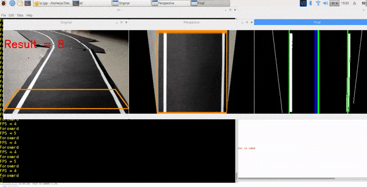

# Self_Driven_Car
Autonomous Self Driven Car using Computer Vision, Raspberry Pi and Arduino.

We have developed our own Late Detection Algorithm using pixel intensity Distribution collaborated with Canny Edge Detection to identify parallel pathways which is better than existing technology. The car can detect  Road Signs and can also interprets traffic Light Signal using OpenCV and controls itself accordingly by forwarding impulses to arduino to control rotor's rotational speed.
The car can impact a lot in reducing road accidents.Current research focuses on increasing speed of processing power,stability improvement and noise reduction in movement.

